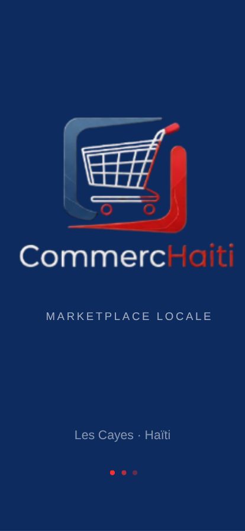
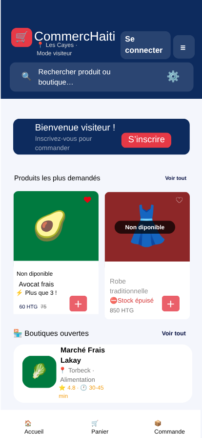
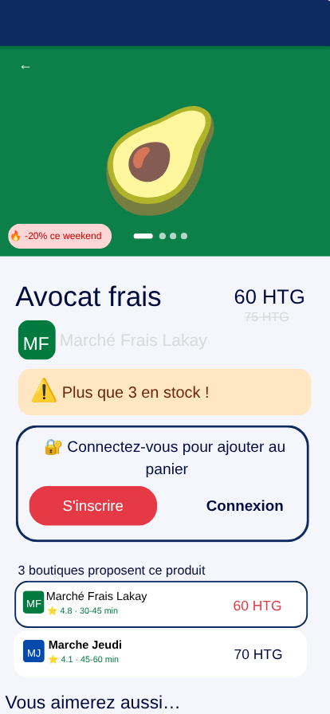
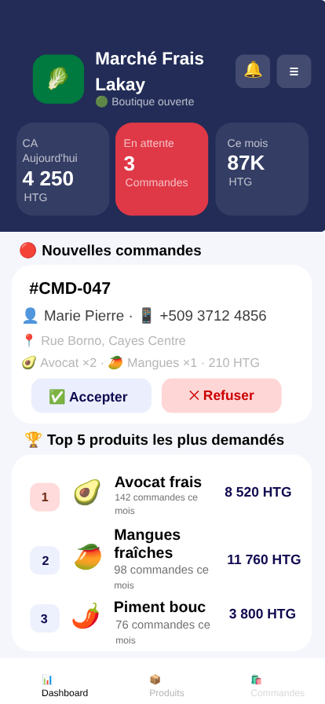

# 🛍️ CommercHaiti

**Marketplace mobile connectant vendeurs et clients en Haïti** — commande, livraison locale et suivi en temps réel, depuis un seul téléphone.

Projet de fin d'études (ITAC) réalisé avec **Flutter** et **Supabase**.

---

## 📋 Table des matières

- [À propos](#-à-propos)
- [Aperçu](#-aperçu)
- [Fonctionnalités](#-fonctionnalités)
- [Stack technique](#-stack-technique)
- [Architecture du projet](#-architecture-du-projet)
- [Design](#-design)
- [Installation](#-installation)
- [Configuration Supabase](#-configuration-supabase)
- [Base de données](#-base-de-données)
- [Équipe](#-équipe)

---

## 🎯 À propos

CommercHaiti est une application mobile (et web) qui permet aux **petits commerçants haïtiens** de vendre leurs produits en ligne, et aux **clients** de parcourir les boutiques de leur zone, commander et suivre leur livraison — sans jamais avoir besoin d'un site web ou d'une infrastructure lourde.

Le projet répond à un cahier des charges académique complet (33 exigences fonctionnelles, priorisées en méthode MoSCoW) couvrant l'authentification, la gestion de boutique, le catalogue produits, le panier, les commandes, le suivi en temps réel et les statistiques de vente.

## 📱 Aperçu

<p align="center">
  
  
  
  
</p>

<p align="center"><i>Maquette officielle du projet (Canva) — de gauche à droite : écran d'accueil, marketplace visiteur, fiche produit, tableau de bord vendeur.</i></p>

## ✨ Fonctionnalités

### Côté client
- Navigation invité (sans compte) dans les boutiques et produits
- Inscription / connexion par email ou Google
- Recherche et filtrage par catégorie / sous-catégorie
- Catalogue "Tous les produits", toutes boutiques confondues
- Fiche produit détaillée (photos, couleurs, tailles, stock en temps réel, produits similaires)
- Panier + commande directe ("Commander" en un clic, sans passer par le panier)
- Suivi de commande en temps réel (Supabase Realtime)
- Reçu de commande en **PDF** et en **image** (partage WhatsApp)
- Favoris, avis clients, mode sombre

### Côté vendeur
- Création de boutique avec code unique généré automatiquement
- Tableau de bord : chiffre d'affaires (jour / mois), commandes en attente, alertes stock bas, Top 5 / Flop 5 produits
- Gestion du catalogue (ajout / édition / suppression, disponibilité, promotions)
- Gestion des commandes (accepter / refuser / mettre à jour le statut) avec mise à jour en temps réel
- Paramètres boutique, notifications, mode sombre

## 🛠️ Stack technique

| Domaine | Technologie |
|---|---|
| Framework | [Flutter](https://flutter.dev) (Dart) |
| Backend | [Supabase](https://supabase.com) — PostgreSQL, Auth, Storage, Realtime |
| Navigation | [go_router](https://pub.dev/packages/go_router) |
| Gestion d'état | [provider](https://pub.dev/packages/provider) |
| Génération PDF | [pdf](https://pub.dev/packages/pdf) / [printing](https://pub.dev/packages/printing) |
| Partage | [share_plus](https://pub.dev/packages/share_plus) |
| Médias | [image_picker](https://pub.dev/packages/image_picker) / [flutter_image_compress](https://pub.dev/packages/flutter_image_compress) |

## 🏗️ Architecture du projet

```
lib/
├── main.dart                 # Point d'entrée, init Supabase, MultiProvider, GoRouter
├── router/                   # Table de routes (go_router)
├── config/                   # Configuration Supabase (URL, clé publique)
├── constants/                # Palette de couleurs, thème
├── models/                   # Modèles de données (Produit, Commande, Boutique, Utilisateur…)
├── providers/                # État applicatif (Auth, Panier, Commandes, Boutiques, Thème…)
├── services/                 # Accès Supabase (Auth, Base de données, Stockage, Reçus)
├── screens/
│   ├── auth/                 # Splash, onboarding, connexion, choix de rôle, création boutique
│   ├── client/                # Accueil, boutiques, produits, profil, favoris
│   ├── orders/                # Panier, formulaire de commande, suivi, historique
│   ├── vendor/                # Dashboard, catalogue, commandes, statistiques
│   └── settings/              # Paramètres client / vendeur
└── widgets/                   # Composants réutilisables (cartes, badges, boutons…)

supabase/
├── schema.sql                # Tables + Row Level Security
├── functions.sql             # Fonctions RPC (commande atomique, téléphone vendeur…)
├── fix_realtime.sql          # Activation Realtime sur les tables
└── seed.sql                  # Données de démonstration
```

## 🎨 Design

Palette inspirée de la maquette Canva du projet :

| Couleur | Usage |
|---|---|
| `#0D2B5E` (navy) | En-têtes, boutons secondaires |
| `#E63946` (rouge) | Boutons d'action principaux (CTA) |
| `#F2F4F8` (gris clair) | Arrière-plans |

Icônes : [Material Icons](https://fonts.google.com/icons) — aucune emoji dans l'interface.

## 🚀 Installation

### Prérequis
- [Flutter SDK](https://docs.flutter.dev/get-started/install) ≥ 3.10
- Un projet [Supabase](https://supabase.com) (gratuit)

### Étapes

```bash
# 1. Cloner le projet
git clone <url-du-repo>
cd commerchaiti

# 2. Installer les dépendances
flutter pub get

# 3. Configurer Supabase (voir section suivante)

# 4. Lancer l'application
flutter run
```

## ⚙️ Configuration Supabase

1. Créez un projet sur [supabase.com](https://supabase.com)
2. Dans `lib/config/supabase_config.dart`, renseignez votre URL et votre clé publique (anon key) :

```dart
class SupabaseConfig {
  static const String url = 'https://VOTRE-PROJET.supabase.co';
  static const String publishableKey = 'VOTRE_CLE_ANON';
}
```

3. Dans l'éditeur SQL de Supabase, exécutez dans l'ordre :
   1. `supabase/schema.sql` — création des tables et des règles RLS
   2. `supabase/functions.sql` — fonctions RPC (commande atomique, etc.)
   3. `supabase/fix_realtime.sql` — activation du temps réel
   4. `supabase/seed.sql` *(optionnel)* — données de démonstration

4. **Authentification par email** : Authentication → Sign In / Providers → Email (activé par défaut).

5. **Connexion Google** *(optionnel)* :
   - Créez des identifiants OAuth dans [Google Cloud Console](https://console.cloud.google.com) (type *Web application*)
   - Ajoutez l'URI de redirection : `https://VOTRE-PROJET.supabase.co/auth/v1/callback`
   - Renseignez le Client ID / Secret dans Authentication → Sign In / Providers → Google

## 🗄️ Base de données

Tables principales : `users`, `shops`, `products`, `orders`, `order_items`, `reviews`, `favorites`.

Points clés :
- **Row Level Security (RLS)** activée sur toutes les tables sensibles.
- **`create_order_atomic`** (fonction RPC) : garantit la décrémentation du stock et la création de la commande dans une seule transaction atomique.
- **`get_vendor_telephone`** (fonction `SECURITY DEFINER`) : expose de façon contrôlée le numéro d'un vendeur pour le contact WhatsApp, sans affaiblir les règles RLS de la table `users`.

## 👥 Équipe

Projet réalisé par une équipe de 3 étudiants dans le cadre du cursus ITAC :

- **Faitza COLAS**
- **Claudimyr CASSIGNOL**
- **Falexson MERCIVAL**

---

<p align="center">Fait avec ❤️ en Haïti 🇭🇹</p>
